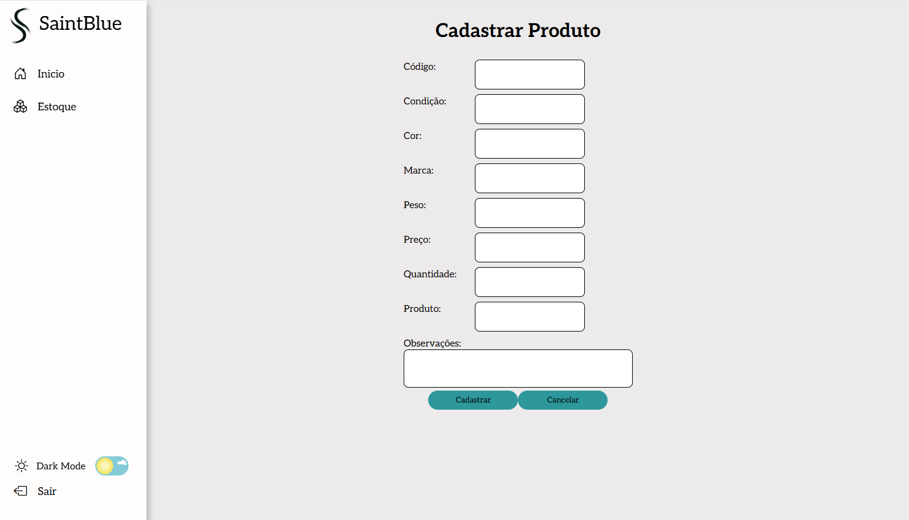

<h1 align="center">
    
SAINT BLUE DESIGN

    
 Venha conhecer o design do nosso site 🔭

</h1>

<h1 align="center">
    
SAINT BLUE DESIGN

    
 Tela de Início
A tela de início fornece uma visão geral do faturamento, vendas realizadas e produtos em estoque.
Faturamento: Dados financeiros atualizados para análise rápida.
Resumo de Vendas: Métricas para acompanhar o desempenho comercial.
Vendas em Estoque: Informações sobre produtos disponíveis e reposição.
Dicas de Gestão: Orientações práticas para otimizar vendas e estoque.
Organizada e intuitiva, facilita o acesso a informações essenciais para a gestão. 🔭

</h1>

<h1 align="center">
    
SAINT BLUE DESIGN

    
 Tela de cadastro: Permite a inserção de dados detalhados sobre os produtos, como código, nome, marca, peso, preço, quantidade, condição, cor e observações. 🔭

    
  
<h1 align="center">
    
SAINT BLUE DESIGN

    
 A tela de edição de cadastro permite atualizar as informações dos produtos cadastrados, incluindo campos como ID, nome, marca, quantidade, cor, preço, condição, peso e observações. É idêntica à tela de edição, proporcionando consistência na interface e eficiência no gerenciamento de dados.🔭

</h1>

<h1 align="center">
    
SAINT BLUE DESIGN

    
 A tela de estoque exibe informações completas dos produtos, como ID, nome, marca, quantidade, cor, preço, condição, peso e observações. Essa estrutura facilita o controle e a gestão eficiente do inventário.🔭

</h1>

